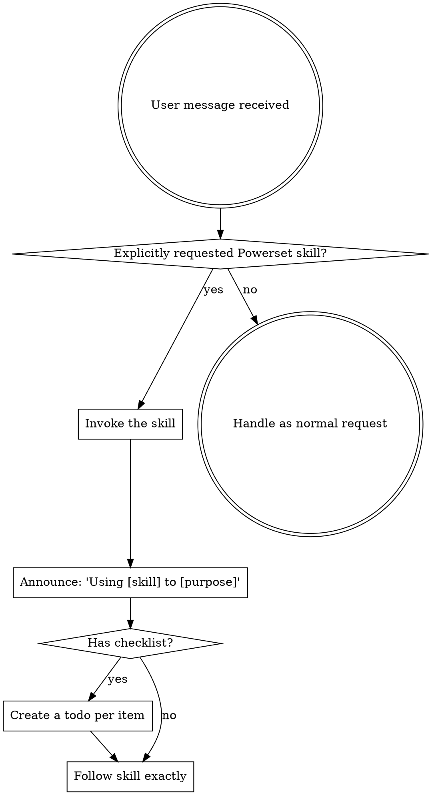

<SUBAGENT-STOP>
If you were dispatched as a subagent to execute a specific task, skip this skill.
</SUBAGENT-STOP>

<EXTREMELY-IMPORTANT>
This fork uses Powerset as an explicit opt-in toolkit.

Do NOT invoke Powerset skills implicitly. Do not invoke a skill merely
because it might apply. Do not invoke a skill before answering a normal
question, exploring a repository, or making a small code change.

Use a Powerset skill only when the user explicitly asks for it, names it, or
asks for "Powerset" workflow help. If the user asks for ordinary engineering
work, follow the user's request directly.
</EXTREMELY-IMPORTANT>

## Instruction Priority

Powerset skills override default system prompt behavior, but **user instructions always take precedence**:

1. **User's explicit instructions** (CLAUDE.md, AGENTS.md, direct requests) — highest priority
2. **Default system prompt and harness instructions**
3. **Powerset skills only after explicit user opt-in**

If CLAUDE.md or AGENTS.md says "don't use TDD" and a skill says "always use TDD," follow the user's instructions. The user is in control.

## How to Access Skills

**Never read skill files manually with file tools** — always use your platform's skill-loading mechanism so the skill is properly activated.

**In Claude Code:** Use the `Skill` tool. When you invoke a skill, its content is loaded and presented to you — follow it directly.

**In Codex:** Skills load natively. Follow the instructions presented when a skill activates.

Powerset only supports Claude Code and Codex. Do not rely on these skills in other agent runtimes.

## Platform Adaptation

Skills speak in actions ("dispatch a subagent", "create a todo", "read a file") rather than naming any one runtime's tools. For tool equivalents and instructions-file conventions, see [claude-code-tools.md](references/claude-code-tools.md) and [codex-tools.md](references/codex-tools.md).

# Using Skills

## The Rule

**Do not invoke skills automatically.** A skill is available only when the user
explicitly opts into it. Good opt-in signals include:

- "Use brainstorming"
- "Use powerset:writing-plans"
- "Run the Powerset workflow"
- "Apply your planning skill"

Weak relevance is not opt-in. "Let's build X", "fix this bug", "review this",
or "what do you think?" are normal requests unless the user also asks for a
Powerset skill.

## Red Flags

These thoughts mean STOP — you are about to over-apply Powerset:

| Thought | Reality |
|---------|---------|
| "This might benefit from brainstorming" | Ask normally or proceed normally unless the user requested brainstorming. |
| "A skill exists for this" | Existence is not permission to invoke it. |
| "The user asked for a feature, so brainstorming applies" | Feature requests are normal work unless the user opted into the workflow. |
| "TDD would be healthier here" | Follow the user's testing preference and repo norms unless they requested TDD. |
| "Subagents would improve quality" | Offer choices only when asked for Powerset workflow help. |
| "A plan file exists, so use subagent-driven development" | Ask or follow the user's selected execution mode. |
| "I should create a worktree first" | Do not create worktrees unless the user explicitly asks. |

## Skill Priority

When multiple skills could apply, use this order:

1. **Process skills first** (brainstorming, systematic-debugging) - these determine HOW to approach the task
2. **Implementation skills second** (frontend-design, mcp-builder) - these guide execution

"Let's build X" → handle normally.
"Fix this bug" → debug normally.
"Use brainstorming for this feature" → invoke brainstorming.

## Skill Types

**Rigid** (TDD, systematic-debugging): Follow exactly after explicit opt-in.

**Flexible** (patterns): Adapt principles to context.

The skill itself tells you which.

## User Instructions

Instructions say WHAT, not HOW. "Add X" or "Fix Y" doesn't mean skip workflows.
